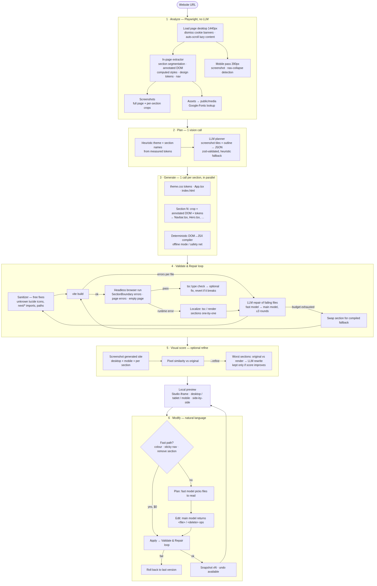
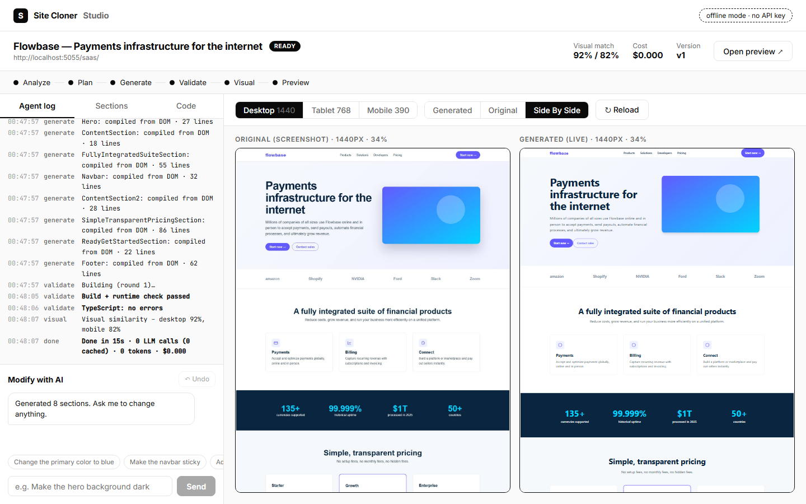
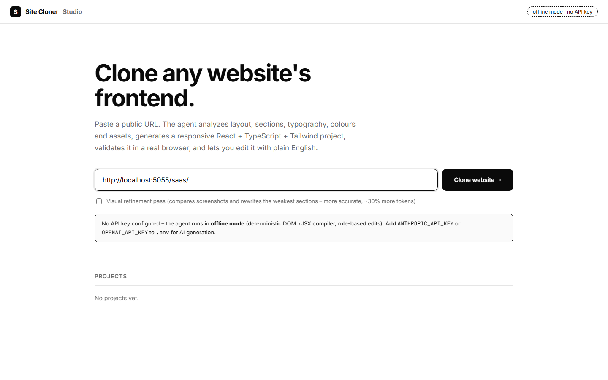
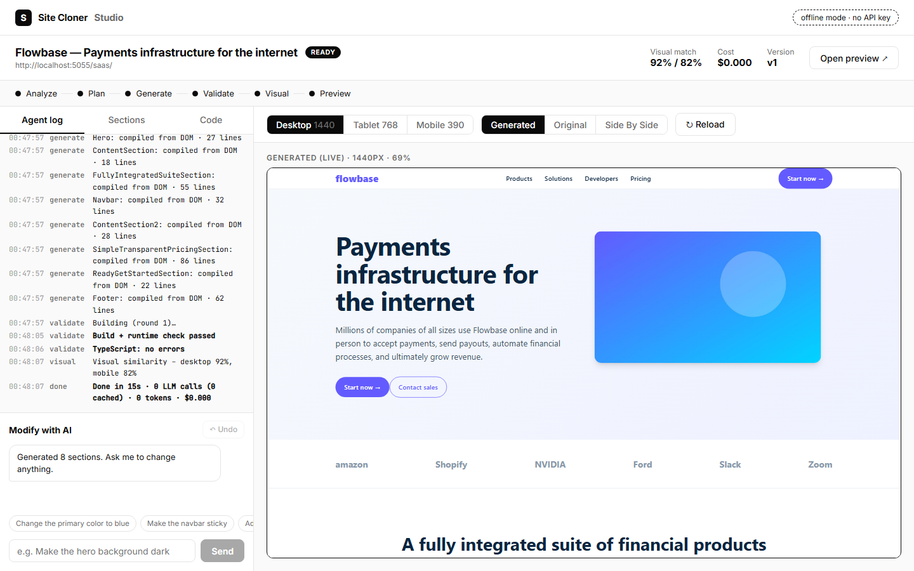
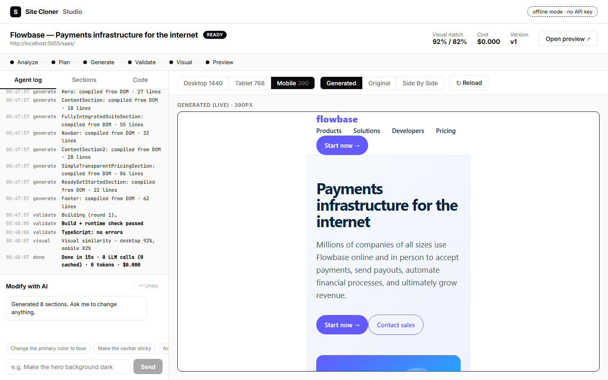

# Site Cloner

An AI agent that clones the frontend of a public website. Paste a URL and it analyzes the page (layout, sections, text, images, colours, typography, spacing, responsive behaviour), generates a **React 19 + TypeScript + Tailwind v4** project, builds and runs it in a headless browser, repairs its own errors and shows a live local preview. You can then edit the result in plain English ("make the navbar sticky", "add a testimonials section").

The output is a new, component-based codebase. It does not embed or proxy the original site.



## Quick start

**Requirements:** Node.js 20 or newer and npm. On Windows, use PowerShell or Git Bash.

```bash
# 1. Install everything: root deps, the generated-site template deps and Chromium for Playwright
npm run setup

# 2. Create your config file
#    macOS/Linux/Git Bash:  cp .env.example .env
#    PowerShell:            Copy-Item .env.example .env
#    then open .env and set ANTHROPIC_API_KEY (or OPENAI_API_KEY)

# 3. Build the studio UI and start the server
npm start
```

Open **http://localhost:4000**, paste a URL and click **Clone**.

### No API key?

Leave the key empty (or set `LLM_PROVIDER=offline`) and the agent runs in offline mode. A deterministic DOM-to-JSX compiler generates the site and rule-based edits handle colours, the sticky navbar and removing sections. It costs nothing and is a good way to try the tool out.

### Command line

```bash
npm run clone  -- https://example.com --refine     # clone a site (--refine = visual refinement pass)
npm run modify -- <project-id> "Change the primary color to blue"
```

Every clone is written to `workspaces/<project-id>/` and is a standalone Vite app:

```bash
cd workspaces/<project-id>
npm run dev
```

### Try it on a local test site

```bash
npm run fixtures        # serves http://localhost:5055/{saas,bakery,portfolio}/
```

Then clone `http://localhost:5055/bakery/` from the studio or the CLI.

## Results

The screenshots below are from cloning the bundled `saas` test site (`http://localhost:5055/saas/`) in offline mode, with no API key and no LLM calls. The run took about 15 seconds and scored 92% visual similarity on desktop and 82% on mobile.

**Original vs generated, side by side**



**Studio home and clone result**

| Home | Result with agent log |
|---|---|
|  |  |

**Responsive output (mobile 390px)**



With an API key, the model generates each section from its screenshot and DOM, which gives more faithful, cleaner components than the offline compiler.

## Configuration

All settings live in `.env` (see [.env.example](.env.example)).

| Variable | Default | Purpose |
|---|---|---|
| `LLM_PROVIDER` | auto | `anthropic`, `openai` or `offline` (auto-detected from the key you set) |
| `ANTHROPIC_API_KEY` / `OPENAI_API_KEY` | empty | Key for the chosen provider |
| `ANTHROPIC_MODEL` / `ANTHROPIC_FAST_MODEL` | `claude-sonnet-4-5` / `claude-haiku-4-5` | Main (vision + codegen) and fast (repairs, edit planning) models |
| `OPENAI_MODEL` / `OPENAI_FAST_MODEL` | `gpt-4.1` / `gpt-4.1-mini` | Same, for OpenAI |
| `LLM_CACHE` | `true` | Cache identical LLM calls in `.cache/llm`, so re-runs are free |
| `MAX_COST_USD` | `3` | Hard spending limit per job |
| `CONCURRENCY` | `4` | Parallel section-generation calls |
| `PORT` | `4000` | Studio server port |

## Scripts

| Command | What it does |
|---|---|
| `npm run setup` | Install all dependencies and Chromium |
| `npm start` | Build the studio and start the server |
| `npm run server` | Start the server without rebuilding the studio |
| `npm run dev:studio` | Studio dev server with hot reload |
| `npm run clone` / `npm run modify` | CLI clone and edit |
| `npm run fixtures` | Serve the local test sites |
| `npm run typecheck` | Type-check the project |

## How it works

| Stage | What happens | Code |
|---|---|---|
| **1. Analyze** | Playwright loads the page at 1440px, dismisses cookie banners and scrolls to trigger lazy content. It splits the page into sections, serializes an annotated DOM for each, measures design tokens (colours, fonts, sizes, radii), downloads images and SVGs, and captures screenshots. A 390px pass records mobile behaviour. | `src/agent/analyze/` |
| **2. Plan** | One vision call turns screenshots, section outline and tokens into a validated JSON plan. A heuristic plan is used if that fails. | `src/agent/generate/plan.ts` |
| **3. Generate** | One parallel call per section produces a `.tsx` component. Tokens go to `src/theme.css` (Tailwind `@theme`). `App.tsx` composes the sections. | `src/agent/generate/` |
| **4. Validate and repair** | Free deterministic fixes, then `vite build`, then a run in headless Chromium that catches runtime errors, empty renders and mobile overflow. Failing files go back to the model with their errors. If repair fails, the section falls back to its compiled version, so the preview always renders. | `src/agent/validate/` |
| **5. Visual score** | The generated site is screenshotted and compared to the original. With `--refine`, the weakest sections are rewritten and kept only if the score improves. | `src/agent/validate/visual.ts` |
| **6. Modify** | Simple requests (theme colour, sticky navbar, remove section) run on a deterministic path with no LLM. Others use two model calls and the same validate/repair loop. Every edit is a snapshot with undo, and a failed edit rolls back. | `src/agent/modify/` |

The **studio** (`studio/`, React) gives you live logs, a stage tracker, desktop/tablet/mobile preview, side-by-side comparison, a code browser and an edit chat with undo. The **server** (`src/server/`, Express) exposes REST and SSE and serves previews at `/preview/<id>/`.

## Troubleshooting

- **Playwright can't find a browser:** run `npx playwright install chromium`.
- **Server says `LLM provider: offline`:** no API key was found. Add `ANTHROPIC_API_KEY` or `OPENAI_API_KEY` to `.env` and restart.
- **Port 4000 is busy:** change `PORT` in `.env`.
- **Windows:** the project's `node_modules` link uses a directory junction, so no admin rights are needed.

## Limitations

- Clones one page, not multi-page navigation. Carousels are static and animations are dropped.
- Canvas/WebGL, videos and iframes become placeholders. Pages are capped at 18 sections.
- Sites behind bot protection, logins or geo-walls may not load.
- Proprietary fonts fall back to a close Google font.
- The similarity score is a coarse pixel metric.
